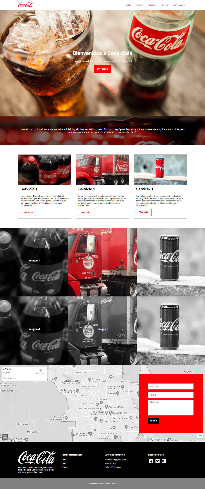
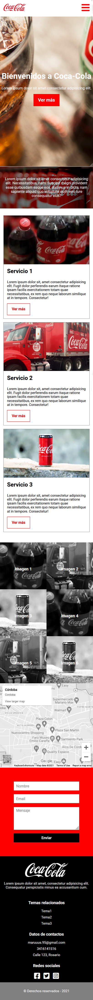

# Coca Cola Project

This is the final project of the Training HappyDev course. It's a Coca Cola's  responsive landing page.
I used XAMPP to access the Apache Server to send an email from the "contáctenos" form.
Click [HERE](https://marianasdiaz.github.io/CocaCola-Project/) to see the project.

## To open the index.php

You can download XAMPP from this link:
[XAMPP](https://www.apachefriends.org/es/download.html)
Once installed, open the XAMPP Control Panel and click the start Apache button.

### This is how it looks

### I want to thank Jacobo Amaru for helping me create this interesting project
