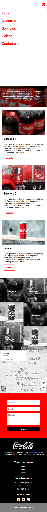

#Coca Cola Project

This is the final project of the Training HappyDev course. It's a Coca Cola's  responsive landing page.
I used XAMPP to access the Apache Server to send an email from the "contáctenos" form.

##This is how it looks:

###I want to thank Jacobo Amaru for helping me create this interesting project.